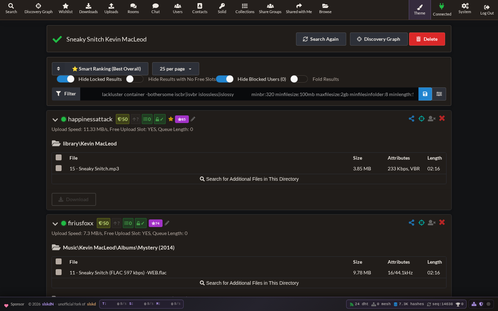
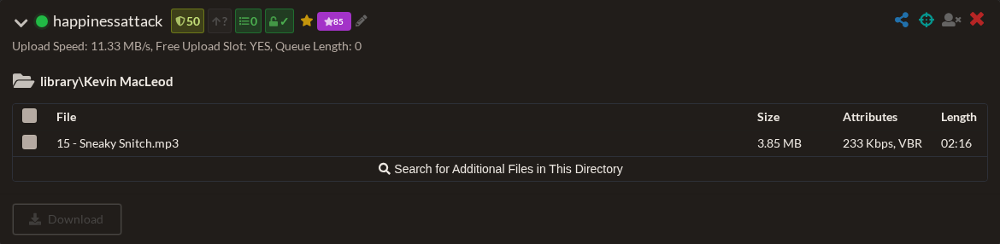
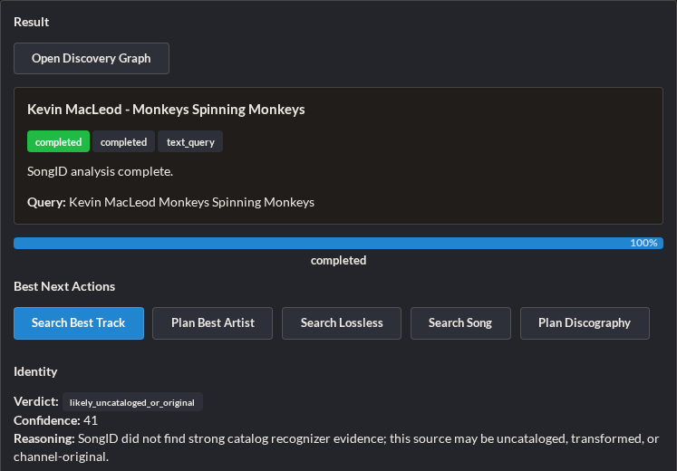
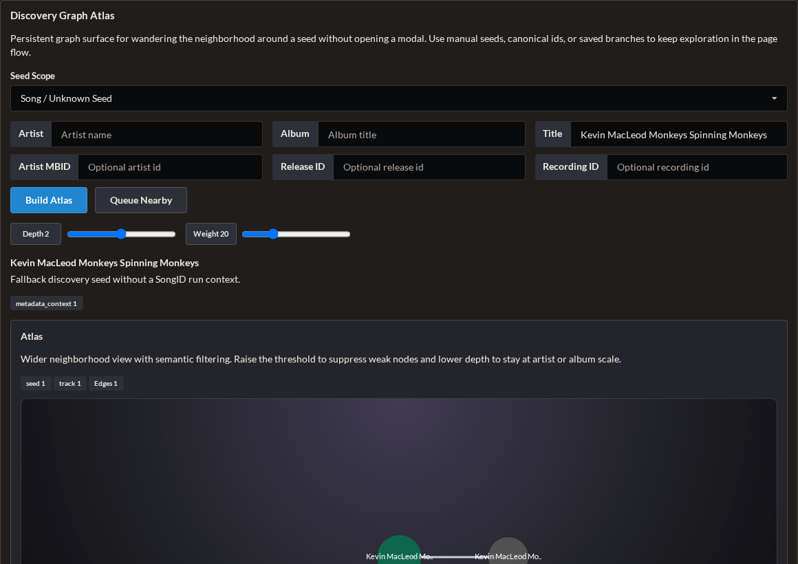
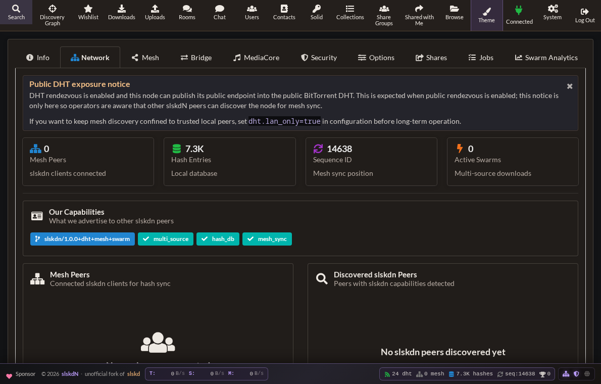
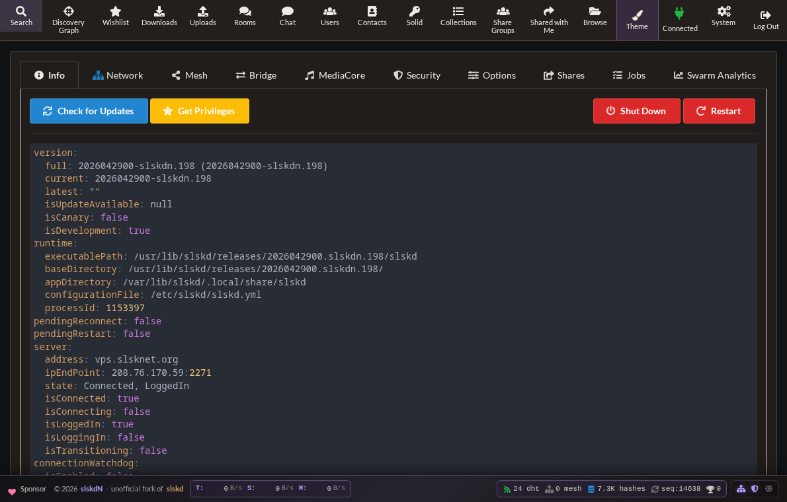
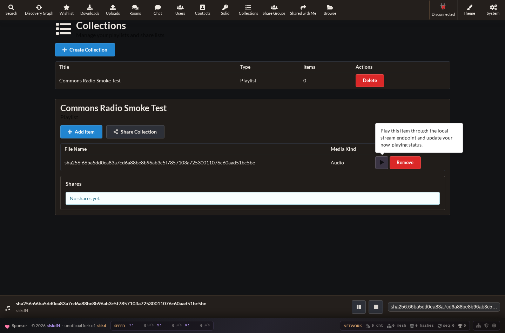

<!-- TODO: replace with slskdN-original logo. Upstream slskd PNG removed. -->
<h1 align="center">slskdN(OT)</h1>
<p align="center"><strong>The batteries-included Soulseek web client</strong></p>
<p align="center">
  <a href="https://github.com/snapetech/slskdn"><strong>slskdN</strong></a>
  is an unofficial fork of
  <a href="https://github.com/slskd/slskd"><strong>slskd</strong></a>.
</p>
<p align="center">
  <a href="https://github.com/snapetech/slskdn/releases">Releases</a> •
  <a href="https://github.com/snapetech/slskdn/issues">Issues</a> •
  <a href="#features">Features</a> •
  <a href="#quick-start">Quick Start</a> •
  <a href="https://discord.gg/5PyXBfvS6T">Discord</a>
</p>
<p align="center">
  <a href="https://github.com/snapetech/slskdn/actions/workflows/build-on-tag.yml"></a>
  <a href="https://github.com/snapetech/slskdn/releases"></a>
  <a href="https://ghcr.io/snapetech/slskdn"></a>
  <a href="https://aur.archlinux.org/packages/slskdn-bin"></a>
  <a href="https://copr.fedorainfracloud.org/coprs/slskdn/slskdn/"></a>
  <a href="https://launchpad.net/~snapetech/+archive/ubuntu/slskdn"></a>
  <a href="https://github.com/snapetech/homebrew-slskdn"></a>
  <a href="https://search.nixos.org/packages?channel=unstable&query=slskdn"></a>
  <a href="https://snapcraft.io/slskdn"></a>
  <a href="https://community.chocolatey.org/packages/slskdn"></a>
  <a href="https://github.com/microsoft/winget-pkgs/tree/master/manifests/s/snapetech/slskdn"></a>
  <a href="https://github.com/slskd/slskd/releases/tag/0.24.5"></a>
  <a href="https://github.com/snapetech/slskdn/blob/main/LICENSE"></a>
  <a href="https://discord.gg/NRzj8xycQZ"></a>
</p>

---

<small>

## What is slskdN?
**[slskdN(OT)](https://github.com/snapetech/slskdn)** (as in, NOT slskd), is a richly feature-added, unofficial fork of [slskd](https://github.com/slskd/slskd), the modern web-based Soulseek client. While slskd focuses on being a lean, API-first daemon that lets users implement advanced features via external scripts, **slskdN takes the opposite approach**:
> **Everything built-in. No scripts required.**

If you've ever seen a feature request closed with *"this can be done via the API with a script"* and thought *"but I just want it to work"*—slskdN is for you. The Big 'N' also stands for the Big Network we have integrated and layered into slskdN that extends the client functionality and network in ways that we think improve trust, fidelity, security, and quality.

## Screenshots
<table>
  <tr>
    <td align="center" width="33%">
      <a href="docs/assets/readme-showcase/search-cc-track-results.png">
        
      </a>
      <br>
      <sub>Smart-ranked search results</sub>
    </td>
    <td align="center" width="33%">
      <a href="docs/assets/readme-showcase/search-cc-track-result-card.png">
        
      </a>
      <br>
      <sub>Expanded source card with ranking signals</sub>
    </td>
    <td align="center" width="33%">
      <a href="docs/assets/readme-showcase/songid-cc-youtube-result.png">
        
      </a>
      <br>
      <sub>SongID handoff from a YouTube source</sub>
    </td>
  </tr>
  <tr>
    <td align="center" width="33%">
      <a href="docs/assets/readme-showcase/songid-discovery-graph.png">
        
      </a>
      <br>
      <sub>Discovery Graph Atlas candidate neighborhood</sub>
    </td>
    <td align="center" width="33%">
      <a href="docs/assets/readme-showcase/network-health-dashboard.png">
        
      </a>
      <br>
      <sub>Network health, DHT, mesh, and capability status</sub>
    </td>
    <td align="center" width="33%">
      <a href="docs/assets/readme-showcase/system-overview-version.png">
        
      </a>
      <br>
      <sub>System overview and slskdN build details</sub>
    </td>
  </tr>
  <tr>
    <td align="center" width="33%">
      <a href="docs/assets/readme-showcase/player-commons-smoke.png">
        
      </a>
      <br>
      <sub>Collections playlist streaming through the integrated player</sub>
    </td>
  </tr>
</table>

## Features

### 🌌 Discovery Graph / Constellation
A live, navigable similarity topology for music discovery and identity context.
- **Typed graph neighborhoods** for SongID, MusicBrainz targets, and search-result seeds
- **Near means meaningfully near** — nodes are connected with weighted, explainable edges
- **Actions, not wallpaper** — recenter, queue nearby, pin, compare, save branch
- **Current surfaces** — SongID mini-map and modal, MusicBrainz graph launcher, search-result graph glyphs, search-list/detail launchers, an in-page atlas panel, and a dedicated `/discovery-graph` route

### 🎧 SongID
Native identification pipeline that turns messy sources into ranked acquisition paths.
- **Input sources** — YouTube URLs, Spotify URLs, direct text queries, and server-side local files
- **Evidence fusion** — MusicBrainz, AcoustID, SongRec, transcripts, OCR, comments, chapters, provenance, perturbation probes, Panako, Audfprint, Demucs stems
- **Forensic + identity context** — lane-level forensic matrix (identity, provenance, spectral, descriptor, lyrics, structural, generator family, confidence), synthetic vs identity assessments, `topEvidenceFor`/`topEvidenceAgainst`, `qualityClass`, `knownFamilyScore`, `perturbationStability`, and C2PA provenance hints keep the UI explainable even when the source is suspicious
- **Queue-native execution** — durable background queue, fixed worker concurrency, persisted runs, live progress over SignalR
- **Infinite queue + configurable workers** — the SongID queue accepts unbounded submissions, stores queue position/worker slot in SQLite, recovers runs after restart, and respects `--songid-max-concurrent-runs` / `SONGID_MAX_CONCURRENT_RUNS` so exactly `X` workers process runs at a time
- **Result actions** — search song, prepare album, download album, plan discography, batch top-candidate fan-out
- **Ranked acquisition & mix planning** — track/album/discography options leverage `SongIdScoring.ComputeIdentityFirstOverallScore`, `Split Into Track Plans` handles mixes, and candidate fan-outs (`Search Top Candidates`) keep identity/quality/Byzantine ordering front and center
- **Identity-first planning** — synthetic / AI-origin heuristics are surfaced as context, not used to override strong catalog identity

### 🔄 Auto-Replace Stuck Downloads
Downloads get stuck. Users go offline. Transfers time out. Instead of manually searching for alternatives, slskdN does it automatically.
- Toggle switch in Downloads header ("Auto-Replace")
- Detects stuck downloads (timed out, errored, rejected, cancelled)
- Searches network for alternatives, filters by extension and size (default 5%)
- Ranks by size match, free slots, queue depth, speed
- Auto-cancels stuck download and enqueues best alternative
```bash
--auto-replace-enabled  --auto-replace-max-size-diff-percent 5.0  --auto-replace-interval 60
```

### ⭐ Wishlist / Background Search
Save searches that run automatically in the background. Never miss rare content again.
- New **Wishlist** item in navigation sidebar
- Add searches with custom filters and max results
- Toggle auto-download, configurable interval, track matches and run history
- Manual "Run Now" button for each search
- **Discography Concierge handoff** — missing tracks from an artist coverage map can be promoted into conservative Wishlist searches without starting immediate searches or downloads
```bash
--wishlist-enabled  --wishlist-interval 60  --wishlist-auto-download  --wishlist-max-results 100
```

### 📁 Multiple Download Destinations
Configure multiple download folders and choose where files go.
```yaml
destinations:
  folders:
    - name: "Music"
      path: "/downloads/music"
      default: true
    - name: "Audiobooks"
      path: "/downloads/audiobooks"
```

### 🗑️ Clear All Searches
One-click cleanup for your search history.
- Red **"Clear All"** button in top-right of search list
- Removes all completed searches, real-time UI update via SignalR

### 🧠 Smart Search Result Ranking
Intelligent sorting that considers multiple factors to show best sources first.
- New default sort: **"⭐ Smart Ranking (Best Overall)"**
- Combines: Upload speed (40pts), Queue length (30pts), Free slot (15pts), History (+/-15pts)
- Purple badge shows smart score next to each username
- Also adds **"File Count"** sort option

### 📊 User Download History Badges
See at a glance which users you've successfully downloaded from before.
- 🟢 **Green** = 5+ successful downloads | 🔵 **Blue** = 1-4 successful | 🟠 **Orange** = More failures
- Hover for exact counts

### 🚫 Block Users from Search Results
Hide specific users from your search results.
- Click user icon (👤✕) to block, **"Hide Blocked Users (N)"** toggle
- Block list stored in localStorage, persists across sessions

### 🗑️ Delete Files on Disk
Clean up unwanted downloads directly from the UI.
- **"Remove and Delete File(s) from Disk"** button in Downloads
- Deletes file AND removes from list, cleans empty parent directories

### 💾 Save Search Filters
Set your preferred search filters once and forget them.
- Enter filters (e.g. `isLossless minbr:320`), click **Save** icon
- Filters auto-load for all future searches

### 🔍 Advanced Search Filters & Page Size
Power user filtering with a visual interface.
- **Visual Filter Editor**: Bitrate, Duration, File Size (Min/Max), CBR/VBR/Lossless toggles
- **Text syntax**: include words normally, exclude with `-term`, restrict formats with `ext:flac,mp3`, and combine quality filters like `minbr:320`, `minbd:16`, `minsr:44100`, `minfs:100mb`, `maxfs:2gb`, `minlen:180`, `minfif:8`, `islossless`, `islossy`, `iscbr`, or `isvbr`
- **Page Size**: 25, 50, 100, 200, 500 results per page
- Settings persist across sessions

### 📝 User Notes & Ratings
Keep track of users with persistent notes and color-coded ratings.
- Add notes from Search Results or Browse views
- Assign color ratings (Red, Green, etc.), mark as "High Priority"

### 💬 Improved Chat Rooms
Enhanced interaction in chat rooms.
- Right-click users: **Browse Files**, **Private Chat**, **Add Notes**

### 📂 Multi-Select Folder Downloads
Download multiple folders at once with checkbox selection.
- In Browse view, check folders and click "Download Selected"
- Recursively collects all files in folders/subfolders

### 📱 Ntfy & Pushover Notifications
Get notified on your phone when important things happen.
- Native support for **Ntfy** and **Pushover**
- Notifications for Private Messages and Room Mentions

### 📑 Tabbed Browsing
Browse multiple users at once.
- Open multiple users in separate tabs, state preserved per tab
- Browse data cached per-user

### 🧠 Unified Smart Source Ranking
All automatic downloads use intelligent source selection based on your history.
- Tracks success/failure rates per user, used by auto-replace and wishlist
- API endpoint at `/api/v0/ranking`

### 🎵 Now Playing / Scrobble Integration
Show what you're listening to in your Soulseek profile — automatically updated from Plex, Jellyfin, or any media player.
- Webhook at `POST /api/v0/nowplaying/webhook` accepts Plex, Jellyfin/Emby, Tautulli, and generic JSON
- Auto-updates your Soulseek user description: `🎵 Listening to: Artist – Title`
- REST API (`GET/PUT/DELETE /api/v0/nowplaying`) for manual or scripted control

### 🎛️ Integrated Web Player & Listening Parties
Play local shared/downloaded audio, collections, and pod listen-along sessions directly in the Web UI. No separate streaming server is required.
- Footer-safe player drawer with collapse/expand, previous/next, rewind, fast-forward, stop, browser-local mute, and browser Media Session controls
- **Collections browser** modal for picking tracks from playlists/share lists, plus **Files browser** modal for searchable shared/downloaded local audio
- Integrated `GET /api/v0/streams/{contentId}` range playback for local audio content IDs with normal auth/share-token and stream-limit boundaries
- Local audio can resolve from configured share and download roots, keeping browser playback inside slskdN instead of a separate media server
- MilkDrop visualizer with inline, full-window, and fullscreen modes
- 10-band browser-local equalizer with persisted presets
- Lightweight spectrum analyzer and oscilloscope for lower-GPU visual feedback
- Optional external visualizer launcher for configured host-side tools such as MilkDrop3
- Synced lyrics pane using LRCLIB lookups from the current artist/title
- Optional ListenBrainz now-playing and scrobble submission with a token stored in browser localStorage
- Optional five-second crossfade between queue items
- Document Picture-in-Picture spectrum window on browsers that support it
- Karaoke-style center-channel vocal reduction toggle
- Pod listening parties publish metadata-only play/pause/seek/stop messages, while the opt-in global radio registry can list parties across the mesh

📖 **Docs**: [Listening Party and Player](docs/listening-party.md)

### 🚫 Cancel Transfers on Ban
When you add a user to the blacklist, their active downloads and uploads are cancelled immediately — no restart required.

### 📁 File Type Restrictions per Group
Control which file types each upload group can request.
```yaml
groups:
  user_defined:
    FriendsOnly:
      upload:
        allowed_file_types: [".flac", ".mp3", ".opus"]
```

### 📊 Prometheus Metrics Dashboard
Built-in metrics UI in the System section. View transfer counts, search rates, memory usage, and all `slskd_*` metrics — no external Grafana required.
- **System → Metrics** tab
- KPI panels: Transfers, Search, Process, Network
- Full raw metrics table with descriptions

### 🏅 User Score Badges Everywhere
Reputation and stats badges (upload speed, queue length, free slot) appear next to usernames in chat messages, room user lists, search results, browse view, and transfers.

### 📱 PWA & Mobile Support
Install slskdN as an app on your phone.
- Add to Home Screen on iOS/Android, standalone mode
- The integrated player uses inline browser audio, safe-area-aware footer spacing, and Media Session controls where supported.

---

## 🚀 Advanced Features

The following advanced features are **fully implemented and production-ready**:

### 🚀 Multi-Source Swarm Downloads
Resilient acquisition built **on top of** the regular Soulseek path — not in place of it.

- **Default downloads are unchanged.** The standard single-source Soulseek flow handles normal transfers; acceleration only runs when enabled from the Downloads header or when called explicitly by an integration.
- **First-class Downloads toggle** — the Downloads section exposes an `Accelerated` switch. When off, underperformance rescue is suppressed. When on, queued-too-long, slow, or stalled downloads can be rescued under the same network-health guardrails.
- **Conservative entry points**: explicit user/API call, Downloads `Accelerated` rescue after underperformance, and `LibraryHealthRemediationService` auto-fix for bad transcodes.
- **Trust-aware policy split:**
  - *Mesh-overlay peers* (other slskdN nodes): protocol-aware → **parallel chunked downloads**.
  - *Public Soulseek peers*: not protocol-aware → **sequential failover** (one peer at a time, resume offset preserved on stall) so no chunk-by-chunk cancellation noise lands on Nicotine+/SoulseekQt UIs.
- **Hard floor before chunking** — declines multi-source unless ≥2 sources share a verified content hash, or all sources are mesh-overlay.
- **SHA-256 verification with a persistent per-peer-per-day probe budget** — ensures bit-identity across sources without hammering any single uploader with verification or discovery hash probes.
- **HashDb mesh gossip** fills the protocol-level gap that Soulseek has no content hashes.
- **Observability** — Prometheus counters for cancellations, probes, hard-floor fallbacks, and failover events surface the network impact directly.

📖 **Design docs**: [Scope, mechanics, and network impact](docs/multipart-downloads.md) • [Architecture](docs/multi-swarm-architecture.md) • [Roadmap](docs/multi-swarm-roadmap.md) • [Rescue mode](docs/phase2-rescue-mode-design.md) • [Scheduling](docs/phase2-swarm-scheduling-design.md)

### 📊 Swarm Analytics & Insights
Understand swarm performance and make data-driven optimizations.
- **Analytics service** — success rates, speed, duration, and chunk efficiency
- **Peer rankings** — reputation, RTT, throughput, and success metrics
- **System UI dashboard** — trends, recommendations, and summaries

### 🌐 DHT Peer Discovery & Mesh Networking
Discover other slskdN users via BitTorrent DHT and form encrypted mesh overlay.
- **DHT bootstrap** — 60+ bootstrap nodes for peer discovery
- **Mesh overlay network** — TLS-encrypted P2P connections
- **Hash database sync** — Epidemic protocol for content verification database
- **Peer greeting service** — Auto-discovery and handshake
- **NAT detection** — UPnP/NAT-PMP port mapping
- **Live status bar** — Real-time DHT nodes, mesh peers, hash counts in UI footer


📖 **Design docs**: [MeshCore research](docs/phase8-meshcore-research.md) • [Mesh architecture](docs/virtual-soulfind-mesh-architecture.md)

### 🔒 Security Hardening
Zero-trust security framework with defense-in-depth:
- **NetworkGuard** — Rate limiting, connection caps per IP
- **ViolationTracker** — Auto-escalating bans for bad actors
- **PathGuard** — Directory traversal prevention (always enabled)
- **ContentSafety** — Magic byte verification, quarantine suspicious files
- **PeerReputation** — Behavioral scoring system
- **CryptographicCommitment** — Pre-transfer hash commitment
- **ProofOfStorage** — Random chunk challenges
- **ByzantineConsensus** — 2/3+1 voting for multi-source verification
- **Security dashboard** — Real-time monitoring in Web UI (System → Security tab)


📖 **Design docs**: [Security implementation](docs/SECURITY_IMPLEMENTATION_SPECS.md) • [Guidelines](docs/SECURITY-GUIDELINES.md) • [Database poisoning](docs/security/database-poisoning-analysis.md) • [Adversarial resilience](docs/phase12-adversarial-resilience-design.md)

### 🎵 MusicBrainz Integration & Library Health
Automated metadata enrichment and quality assurance.
- **MusicBrainz Client** — Query recordings, releases, artists
- **Album Targets** — MBID-based album tracking and completion monitoring
- **Discography Concierge** — Map an artist MBID into release/track coverage, mark tracks as verified, Wishlist-seeded, ambiguous, or missing, and seed missing tracks into Wishlist on demand
- **Chromaprint Integration** — Audio fingerprinting for identification
- **AcoustID API** — Fingerprint-to-MBID lookups
- **Auto-Tagging Pipeline** — Automatic metadata tagging from MusicBrainz
- **Library Health Scanner** — Detects transcodes, quality issues, missing tracks
- **Remediation Service** — Auto-fix via automatic re-download of better quality

> **⚠️ Privacy tradeoff.** MusicBrainz and AcoustID are third-party services. When enabled, slskdN sends per-track fingerprints, MBIDs, and/or query terms from your node's IP to `musicbrainz.org` and `api.acoustid.org`. These services log requests. If you don't want your library activity observable by those hosts:
> - Leave **AcoustID disabled** (`integrations.acoustId.enabled: false`, the default) — this disables fingerprint uploads.
> - Point **MusicBrainz** at a self-hosted mirror or a VRS/VPN egress by changing `integrations.musicBrainz.baseUrl`.
> - Or disable the auto-tagging / library-health features that trigger the lookups.


📖 **Design docs**: [Canonical scoring](docs/phase2-canonical-scoring-design.md) • [Library health](docs/phase2-library-health-design.md) • [Advanced fingerprinting](docs/phase2-advanced-fingerprinting-design.md) • [Music discovery federation plan](docs/design/music-discovery-federation-plan.md)

### 📦 Pod System (Decentralized Communities)
Topic-based micro-communities over the mesh overlay.
- **Pod creation/management** — Private, Unlisted, or Listed visibility
- **DHT-based pod discovery** — Find pods by name, focus, or tags
- **Decentralized chat** — Pod messaging over mesh overlay
- **Soulseek chat bridge** — Bridge legacy Soulseek rooms to pods
- **Gold Star Club** — Default-on auto-join pod for the first 250 users, used for realm governance bootstrap plus early-stage testing and feedback. Operators can opt out before startup with `SLSKDN_POD_GOLD_STAR_CLUB_AUTOJOIN=false`; users can later leave the pod from the Web UI, but leaving is irrevocable and permanently revokes local Gold Star status.
- **Pod APIs** — Full REST API for pod operations


📖 **Design docs**: [PodCore research](docs/phase10-podcore-research.md) • [Chat bridge](docs/design/pods-soulseek-chat-bridge.md) • [Gold Star Club](docs/design/gold-star-club.md) • [API design](docs/pod-api-design.md)

### 🌐 Solid Integration (WebID & Solid-OIDC)
Optional integration with Solid for decentralized identity and Pod-backed metadata storage.
- **WebID resolution** — Resolve WebID profiles and extract OIDC issuer information
- **Solid-OIDC Client ID Document** — Serves compliant JSON-LD document at `/solid/clientid.jsonld` (dereferenceable per Solid-OIDC spec)
- **SSRF hardening** — Comprehensive security controls:
  - **Host allow-list** (`AllowedHosts`) — Empty list denies all remote fetches by default (SSRF protection)
  - **HTTPS-only enforcement** — Configurable `AllowInsecureHttp` for dev/test only
  - **Private IP blocking** — Automatically blocks localhost, `.local` domains, and RFC1918/link-local IPs
  - **Response limits** — Configurable max response size (1MB default) and timeout (10s default)
- **RDF parsing** — Uses dotNetRDF library for parsing WebID profiles (Turtle and JSON-LD formats)
- **API endpoints** — `GET /api/v0/solid/status` and `POST /api/v0/solid/resolve-webid`
- **Frontend UI** — New "Solid" navigation item and settings page for WebID resolution testing
- **Security by default** — Feature enabled by default but non-functional until `AllowedHosts` is configured (SSRF safety)

**Configuration**:
```yaml
feature:
  Solid: true  # Enable Solid integration (default: true)

solid:
  allowedHosts: []  # Empty = deny all remote fetches (SSRF safety)
                     # Add hostnames like ["your-solid-idp.example", "your-pod-provider.example"]
  timeoutSeconds: 10
  maxFetchBytes: 1000000
  allowInsecureHttp: false  # ONLY for dev/test. Keep false in production
  redirectPath: "/solid/callback"
```

**Future extensions** (planned):
- Full OIDC Authorization Code + PKCE flow
- Token storage (encrypted via Data Protection)
- DPoP proof generation
- Pod metadata read/write (playlists, sharelists)
- Type Index / SAI registry discovery
- Access control (WAC/ACP) writers

📖 **Design docs**: [Solid implementation map](docs/dev/SOLID_IMPLEMENTATION_MAP.md) • [User guide](docs/SOLID_USER_GUIDE.md)

### 🎭 VirtualSoulfind & Shadow Index
Decentralized content discovery without relying solely on the Soulseek network.
- **Shadow Index** — Decentralized MBID→peers mapping
- **Traffic Observer** — Observes search results and extracts MBIDs
- **Privacy Controls** — Username pseudonymization, configurable retention
- **Disaster Mode** — Mesh-only operation when Soulseek unavailable
- **Scene System** — Topic-based micro-networks for niche content


📖 **Design docs**: [VirtualSoulfind v2](docs/virtualsoulfind-v2-design.md) • [Implementation design](docs/phase6-virtual-soulfind-implementation-design.md) • [User guide](docs/VIRTUAL_SOULFIND_USER_GUIDE.md) • [Content domains](docs/VIRTUALSOULFIND-CONTENT-DOMAINS.md)

### 📈 Observability & Telemetry
Visibility into performance and network behavior.
- **OpenTelemetry tracing** — `telemetry.tracing` config with console, Jaeger, or OTLP exporters
- **Component activity sources** — transfers, mesh, HashDb, and search tracing

### 🔧 Service Fabric
Generic service layer for mesh-based applications.
- **Service descriptors** — Signed Ed25519 descriptors for service discovery
- **Service directory** — DHT-based service registry
- **Service router** — Routes requests to service providers
- **HTTP gateway** — API key + CSRF authentication for services
- **Service wrappers** — Pods, VirtualSoulfind, introspection wrapped as services


📖 **Design docs**: [Service Fabric tasks](docs/SERVICE_FABRIC_TASKS.md) • [Security audit](docs/T-SF05-AUDIT.md) • [How it works](docs/HOW-IT-WORKS.md)

---

## Quick Start
Getting started is simple.

### Arch Linux (AUR)
**Drop-in replacement for slskd** — preserves your existing config at `/var/lib/slskd/`.
```bash
yay -S slskdn              # build from source (recommended)
yay -S slskdn-bin          # Binary package
sudo systemctl enable --now slskd
```
Access at http://localhost:5030

If an Arch upgrade fails on `python-torchaudio` with `Cannot resume`, slskdn itself is fine — it was blocked only by an optional dependency workflow in AUR. Use the package helper documented at:
- [packaging/aur/README.md#optional-fix-for-pythontorchaudio-download-failures](packaging/aur/README.md#optional-fix-for-python-torchaudio-download-failures)
- `bash ./scripts/fix-python-torchaudio-no-resume.sh`

This issue is **Arch/AUR-only**; other platforms are unaffected by this script.

### Linux Release Zip
For Linux GitHub releases, use the bundled installer helper instead of manually unpacking a zip over an existing `slskd` service install. It rewrites the systemd unit to the extracted release tree so you do not keep launching an older package-managed binary by accident.

```bash
wget https://github.com/snapetech/slskdn/releases/download/0.24.5-slskdn.133/install-linux-release.sh
sudo SLSKDN_VERSION=0.24.5-slskdn.133 bash install-linux-release.sh
```

The installer places the release under `/opt/slskdn`, keeps config at `/etc/slskd/slskd.yml`, and points `slskd.service` at the extracted release.

### Development Builds
For latest experimental features:

<!-- BEGIN_DEV_BUILD -->
**[Development Build master →](https://github.com/snapetech/slskdn/releases/tag/master)** 

Version: `0.24.1-dev-91769043447` | Branch: `master` 

```bash
# Arch Linux (AUR)
yay -S slskdn-dev

# Fedora/RHEL (COPR)
sudo dnf copr enable slskdn/slskdn-dev
sudo dnf install slskdn-dev

# Ubuntu/Debian (PPA)
sudo add-apt-repository ppa:keefshape/slskdn
sudo apt update
sudo apt install slskdn-dev

# Docker
docker pull ghcr.io/snapetech/slskdn:dev
```
<!-- END_DEV_BUILD -->


### Homebrew (macOS/Linux)
```bash
brew tap snapetech/slskdn https://github.com/snapetech/slskdn
brew install snapetech/slskdn/slskdn
```

### Nix (Flake)
```bash
nix profile install github:snapetech/slskdn
```

### Snap (Linux)
```bash
sudo snap install slskdn
```

### Windows (Winget)
```powershell
winget install snapetech.slskdn
```

### Windows (Chocolatey)
```powershell
choco install slskdn
```

### With Docker
```bash
docker run -d \
  -p 5030:5030 -p 50300:50300 \
  -e SLSKD_SLSK_USERNAME=your_username \
  -e SLSKD_SLSK_PASSWORD=your_password \
  -v /path/to/downloads:/downloads \
  -v /path/to/app:/app \
  --name slskdN \
  ghcr.io/snapetech/slskdn:latest
```

### With Docker Compose
```yaml
version: "3"
services:
  slskdN:
    image: ghcr.io/snapetech/slskdn:latest
    container_name: slskdN
    ports:
      - "5030:5030"
      - "50300:50300"
    environment:
      - SLSKD_SLSK_USERNAME=your_username
      - SLSKD_SLSK_PASSWORD=your_password
    volumes:
      - ./app:/app
      - ./downloads:/downloads
      - ./music:/music:ro
    restart: unless-stopped
```

### From Source
```bash
git clone https://github.com/snapetech/slskdn.git && cd slskdn
./scripts/setup-git-hooks.sh
curl -sSL https://dot.net/v1/dotnet-install.sh | bash -s -- --channel 8.0
export PATH="$HOME/.dotnet:$PATH"
dotnet run --project src/slskd/slskd.csproj
```

`./scripts/setup-git-hooks.sh` installs the repo's local `pre-commit` and `pre-push` checks by setting `git config --local core.hooksPath .githooks`.

---

## Comparison with slskd

| Feature | slskd 0.24.5 | slskdN |
|---------|:-----:|:------:|
| Core Soulseek functionality | ✅ | ✅ |
| Web UI & REST API | ✅ | ✅ |
| Auto-replace stuck downloads | ❌ | ✅ |
| Wishlist/background search | ❌ | ✅ |
| Multiple download destinations | ❌ | ✅ |
| Clear all searches | ❌ | ✅ |
| Smart result ranking | ❌ | ✅ |
| User download history badges | ❌ | ✅ |
| Block users from search | ❌ | ✅ |
| Delete files on disk | ❌ | ✅ |
| Batch-aware delete cleanup | ❌ | ✅ |
| Save default filters | ❌ | ✅ |
| Documented advanced filter syntax | ❌ | ✅ |
| Multi-select folder downloads | ❌ | ✅ |
| Ntfy/Pushover notifications | ❌ | ✅ |
| Tabbed browsing | ❌ | ✅ |
| Smart source ranking | ❌ | ✅ |
| User notes & ratings | ❌ | ✅ |
| PWA support | ❌ | ✅ |
| Now Playing / Scrobble | ❌ | ✅ |
| Cancel transfers on ban | ❌ | ✅ |
| File type restrictions per group | ❌ | ✅ |
| Prometheus metrics UI | ❌ | ✅ |
| User score badges everywhere | ❌ | ✅ |
| Transfer peer browse links | ❌ | ✅ |
| Conservative queue-position refresh | ❌ | ✅ |
| **Multi-source downloads** | ❌ | ✅ |
| **DHT mesh networking** | ❌ | ✅ |
| **Security hardening** | ❌ | ✅ |
| **MusicBrainz integration** | ❌ | ✅ |
| **Library health scanner** | ❌ | ✅ |
| **Pod communities** | ❌ | ✅ 🧪 |
| **VirtualSoulfind v2** | ❌ | ✅ 🧪 |
| **Service fabric** | ❌ | ✅ 🧪 |
| Open to community feedback | ✅ | ✅ |

🧪 = Experimental feature, in main build.

---

## Configuration

slskdN uses the same config format as slskd, with additional options:

```yaml
soulseek:
  username: your_username
  password: your_password
  listen_port: 50300

directories:
  downloads: /downloads
  incomplete: /downloads/incomplete

shares:
  directories:
    - /music

web:
  port: 5030
  authentication:
    username: admin
    password: change_me

# slskdN-specific features
global:
  download:
    auto_replace_stuck: true
    auto_replace_threshold: 5.0
    auto_replace_interval: 60
  wishlist:
    enabled: true
    interval: 60
    auto_download: false

destinations:
  folders:
    - name: "Music"
      path: "/downloads/music"
      default: true
    - name: "Audiobooks"
      path: "/downloads/audiobooks"

# Experimental features (dev builds only)
security:
  enabled: true
  profile: Standard  # Minimal, Standard, Maximum, or Custom
  
mesh:
  enabled: true
  dht:
    bootstrap_nodes: 60
  overlay:
    udp_port: 50301
    quic_port: 50302
```

Detailed documentation for configuration options can be found in [docs/config.md](docs/config.md), and an example of the YAML configuration file can be reviewed in [config/slskd.example.yml](config/slskd.example.yml).

---

## Documentation

| Document | Description |
|----------|-------------|
| [Features Overview](docs/FEATURES.md) | Complete feature list and configuration |
| [Advanced Features](docs/advanced-features.md) | Deep dives for major slskdN features |
| [How It Works](docs/HOW-IT-WORKS.md) | Technical architecture and design |
| [Multi-Source Downloads](docs/multipart-downloads.md) | Network impact analysis |
| [DHT Rendezvous Design](docs/DHT_RENDEZVOUS_DESIGN.md) | Peer discovery architecture |
| [Security Specs](docs/SECURITY_IMPLEMENTATION_SPECS.md) | Security feature details |
| [Implementation Roadmap](docs/IMPLEMENTATION_ROADMAP.md) | Development status |
| [Configuration](docs/config.md) | All configuration options |
| [Building](docs/build.md) | Build instructions |
| [Docker](docs/docker.md) | Container deployment |
| [Test Coverage Summary](docs/TEST_COVERAGE_SUMMARY.md) | Current test counts and coverage |
| [Test Coverage Assessment](docs/TEST_COVERAGE_ASSESSMENT.md) | Coverage rationale and gaps |

---

## Experimental Feature Status

Features in the `master` branch:

| Feature Category | Status | Notes |
|------------------|--------|-------|
| **Auto-Replace** | ✅ Stable | Production-ready |
| **Wishlist** | ✅ Stable | Production-ready |
| **Smart Ranking** | ✅ Stable | Production-ready |
| **User Notes** | ✅ Stable | Production-ready |
| **UI Enhancements** | ✅ Stable | Status bars, network monitoring |
| **Now Playing / Scrobble** | ✅ Stable | Plex, Jellyfin, generic JSON |
| **Cancel on Ban** | ✅ Stable | Runtime blacklist enforcement |
| **File Type Restrictions** | ✅ Stable | Per-group upload filtering |
| **Prometheus Metrics UI** | ✅ Stable | Built-in KPI dashboard |
| **User Score Badges** | ✅ Stable | Chat, rooms, transfers |
| **Multi-Source Downloads** | ✅ Stable | Concurrency limits, network-friendly |
| **DHT Peer Discovery** | ✅ Stable | Fully functional mesh overlay |
| **Security Hardening** | ✅ Stable | Comprehensive framework, tested |
| **MusicBrainz Integration** | ✅ Stable | Fingerprinting, auto-tagging |
| **Discography Concierge** | 🟡 Experimental | Artist MBID coverage map and manual Wishlist seeding |
| **Library Health Scanner** | ✅ Stable | Quality detection and remediation |
| **SongID** | 🟡 Experimental | Native source identification, ranked song/album/discography handoff |
| **Discovery Graph / Constellation** | 🟡 Experimental | Navigable similarity topology across SongID, MusicBrainz, and search |
| **PodCore** | 🟡 Experimental | Functional, API may evolve |
| **VirtualSoulfind v2** | 🟡 Experimental | Shadow index, disaster mode |
| **Service Fabric** | 🟡 Experimental | Generic service layer |

For the stable upstream client, see [slskd/slskd](https://github.com/slskd/slskd).

---

## Reverse Proxy
slskdN may require extra configuration when running it behind a reverse proxy. Refer to [docs/reverse_proxy.md](docs/reverse_proxy.md) for a short guide.

---

## Contributing
We welcome contributions from *everyone*—first-timers and veterans alike. No prior commit history required.

1. **Pick an issue** from our [Issue Tracker](https://github.com/snapetech/slskdn/issues)
2. **Fork the repo** and create a feature branch
3. **Submit a PR** with your changes

```bash
cd src/slskd && dotnet watch run     # Backend
cd src/web && npm install && npm start  # Frontend
```

For experimental features, see:
- [SECURITY-GUIDELINES.md](docs/SECURITY-GUIDELINES.md) - Security requirements
- [CURSOR-WARNINGS.md](docs/CURSOR-WARNINGS.md) - LLM implementation risk assessment
- [SERVICE_FABRIC_TASKS.md](docs/SERVICE_FABRIC_TASKS.md) - Task breakdowns

---

## Upstream Contributions
Features that prove stable may be submitted as PRs to upstream slskd. Our auto-replace feature was first: [slskd PR #1553](https://github.com/slskd/slskd/pull/1553). We aim to be a **proving ground**, not a permanent fork. We believe good software comes from open dialogue—not just with established contributors, but with everyone who has something to offer. Our door is always open.

---

## Versioning
slskdN follows slskd's version numbers with a suffix: `0.24.1-slskdN.1` = First slskdN release based on slskd 0.24.1

Development builds use epoch-based versioning: `0.24.1-dev-91769014133` for proper sorting.

---

## License
[GNU Affero General Public License v3.0](LICENSE), same as slskd.

**Key requirements**:
- Source code must be made available when running the software over a network
- Derivative works must also be AGPL-3.0 licensed
- Copyright notices and license information must be preserved

---

## Acknowledgments

**slskdn** is built on the excellent work of others:

### Upstream Project
**[slskdN](https://github.com/snapetech/slskdn)** is an unofficial fork of **[slskd](https://github.com/slskd/slskd)** by jpdillingham and contributors.
- **slskd** is a modern, headless Soulseek client with a web interface and REST API
- Licensed under AGPL-3.0
- We maintain the same license and contribute our changes back to the community
- Philosophy: slskd focuses on a lean core with API-driven extensibility; slskdn focuses on batteries-included features

**Why we forked**: To build experimental features (mesh networking, multi-source downloads, advanced automation) that go beyond slskd's core mission. We deeply respect the upstream project and its maintainer's design philosophy.

### Protocol & Network
- **Soulseek Protocol** - The P2P file-sharing protocol created by Nir Arbel
- **[Soulseek.NET](https://github.com/jpdillingham/Soulseek.NET)** - The excellent .NET Soulseek library
- The Soulseek community

### Metadata & Discovery
- **[MusicBrainz](https://musicbrainz.org/)** - Open music encyclopedia for metadata enrichment
- **[Cover Art Archive](https://coverartarchive.org/)** - Album art for verified releases
- **[AcoustID](https://acoustid.org/)** - Audio fingerprinting service

---

## Use of AI in This Project

This project was built in partnership with tools, not replacements for people. Throughout its development, we made deliberate use of AI-powered assistants—most notably [Cursor](https://cursor.sh) and several leading large language models—as part of the day-to-day engineering workflow.

**These systems helped in three main ways:**

| Area | How AI Assisted |
|------|-----------------|
| **Research & Exploration** | Quickly surfacing prior art, sketching out alternative designs, and pressure-testing edge cases that would have taken much longer to explore alone. |
| **Automation & Busywork** | Generating initial scaffolding, refactoring repetitive patterns, and handling mechanical changes that are important but rarely insightful. |
| **Thinking Partner** | Serving as a second pair of eyes on tricky problems, helping articulate trade-offs, and translating rough ideas into shapes that could be implemented and tested. |

**What these tools did not do is replace responsibility.** Every behavior that matters—protocol decisions, data flows, failure modes, and user-visible effects—was reviewed, edited, or rewritten by a human before it landed in this repository. The models accelerated the work and helped make the project possible at this scope, but accountability for the result sits squarely with the maintainer.

If you're reading this code, you should assume that:
- ✅ AI tools were used as collaborators in research, drafting, and mechanical edits
- ✅ The final form of the project reflects human judgment, testing, and ongoing maintenance

> **In other words: this is an AI-assisted project, not an AI-generated one.**

---

## 📈 Development Statistics

**Based on slskd 0.24.1** with extensive enhancements:

- **Commits ahead**: 4,473+ commits
- **New systems**: 7 major subsystems (Mesh, Swarm, Security, Pods, MediaCore, VirtualSoulfind, Service Fabric)
- **New features**: 132+ individual features
- **Test coverage**: ~2,678 total tests (~2,671 passing, 2-3 skipped)
- **Documentation**: 100+ markdown files
- **Files changed**: 450+ files

---

</small>

<p align="center"><strong>slskdN</strong> — For users who'd rather download music than learn Python.</p>
<p align="center"><em>"built on the backs of giants"</em> 🍦🤖✨</p>
